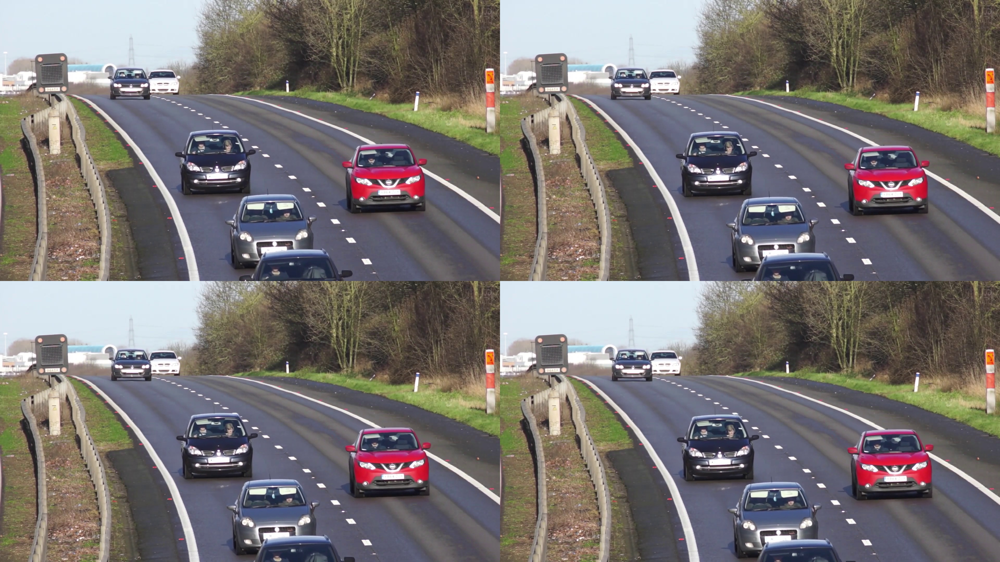

# EfficientStreamOD


Efficient Object Detection on video streams using OpenCV.

The `EfficientStreamOD` module provides an abstract class for efficiently processing video streams and performing object detection. The class uses a grid-based approach to process multiple frames in parallel and improve the overall processing speed.

## Installation

To install the package, run the following command:
```bash
pip install git+https://github.com/rubythalib33/EfficientStreamOD
```

## Benchmark
### Grid Method
#### Methodology
Grid method is as simply stack the frame into one image, for now it's only support for 1, 4 and 9 grid, here's the example
there's 4 frames: A, B, C, D
it will become like this:

#### Experimentation
This code is tested using Ryzen 7 5000 series Laptop CPU to run the object detection, for the architecture I choose [YOLOX-S](https://github.com/Megvii-BaseDetection/YOLOX)
 and run it on onnx environment, here is the benchmark

| Grid Type | Number of Frames Processed | Inference Speed |
|-----------|----------------------------|-----------------|
| 1(no grid)| 1                          | 0.07ms          |
| 4         | 4                          | 0.08ms          |
| 9         | 9                          | 0.1ms           |

#### Conclusion
Process the object detection using more grid will more optimize the performance, but there's a cost of the optimization that more grid you use, the small object in a frame cannot be seen by the AI, and for my experimentation the best result I get is in 4 grid method, because the 4 grid one is still has a stable detection